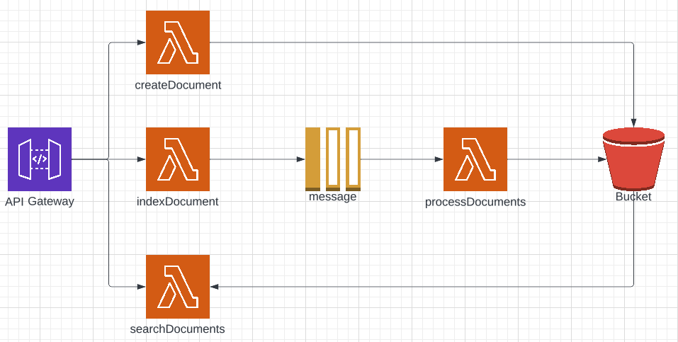

# Serverless Search
This project is a poor man's Elasticsearch. It's a simple and serverless full-text search engine based in [ElasticLunr](https://github.com/weixsong/elasticlunr.js). 


## Getting started

### Deployment

```
$ git clone git@github.com:alanreid/serverless-search.git
$ cd serverless-search
$ npm run deploy
```

After deploying, you should see output similar to:

```bash
Deploying serverless-search to stage dev (eu-central-1)

✔ Service deployed to stack serverless-search-dev (45s)

endpoints:
  POST - https://xxxxxxx.execute-api.eu-central-1.amazonaws.com/document
  POST - https://xxxxxxx.execute-api.eu-central-1.amazonaws.com/document/{type}
  GET - https://xxxxxxx.execute-api.eu-central-1.amazonaws.com/document/{type}/search
functions:
  createDocument: serverless-search-dev-createDocument (673 kB)
  indexDocument: serverless-search-dev-indexDocument (56 kB)
  processDocuments: serverless-search-dev-processDocuments (669 kB)
  search: serverless-search-dev-search (673 kB)
```

_Note_: In current form, after deployment, your API is public and can be invoked by anyone. For production deployments, you might want to configure an authorizer. For details on how to do that, refer to [http event docs](https://www.serverless.com/framework/docs/providers/aws/events/apigateway/).

### Resources
The footprint of this project is quite minimal. The following resources are created:

- 4 Lambda functions and their log groups
- 1 API Gateway with 3 routes
- 1 S3 Bucket
- 1 SQS queue



### Invocation

After successful deployment, you can call the created application via HTTP or simply invoke it using the sample testing events.

```bash
$ npm run invoke:createDocument
$ npm run invoke:indexDocument
$ npm run invoke:processDocuments
$ npm run invoke:searchDocuments
```

---
## Usage

### Create a document
This endpoint creates a type of document. For example, if you'd like to index articles, you could define what fields you'd like to index, like this:
```
POST /document
{
  "type": "article",
  "searchableFields": ["title", "body"]
}
```

You can have multiple types of documents at once. Each type of document is to be searched independently.

### Index a document
This endpoint indexes one document. For example, if you'd like to index an article, you would do so like this:
```
POST /document/article
{
  "id": "article_1",
  "title": "NASA to showcase Webb space telescope's first full-color images",
  "body": "With Webb now finely tuned and fully focused, astronomers will embark on a competitively selected list of science projects exploring the evolution of galaxies, the life cycles of stars, the atmospheres of distant exoplanets and the moons of our outer solar system."
}
```

These requests are sent to a SQS queue and are indexed in batches and stored in S3.

**Important:** Every document requires a unique ID. If you index a document with the same ID, it will replace the existing one. 


### Search a document
This endpoint allows you to search within all the documents of a certain type. For example:
```
GET /document/article/search?query=nasa
```

Which would return the list of IDs that match:
```json
{
  "results": [
    {
      "ref": "article_1",
      "score": 0.5
    }
  ]
}
```

## 